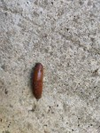

# Arion rufus snails dataset

## Description
This dataset contains 396 images of Arion Rufus snails, a species of land snail commonly found in Europe and Asia. They are one of the most destructive pests in Europe. The images were taken under different lighting conditions and from various angles to provide a diverse set of data for various computer vision applications.

### Features of the dataset
* 396 images of Arion Rufus snails (jpg)
* Every image is labeled with a bounding box (.txt, YOLO format)
* Diverse set of micro-locations, including house backyards, and forest footpaths
* Various lighting conditions
* Various angles

## Dataset outline
The images were captured in the north-eastern region of Slovenia between June and August of 2022. The micro locations of places where images were captured varies from ordinary house backyard to the meadow next to the forest and forest footpaths. Critical surviving factor of slugs is water, therefore they are harder to find during the day, on hot summer days and out in the open. 

## Example images

## Cite this dataset

G. Vrbančič, R. Kukovec, I. Fister, V. Podgorelec, S. Salcedo-Sanz and I. Fister Jr., "Profiling the Arion rufus snails with computer vision," 2022 IEEE 22nd International Symposium on Computational Intelligence and Informatics and 8th IEEE International Conference on Recent Achievements in Mechatronics, Automation, Computer Science and Robotics (CINTI-MACRo), Budapest, Hungary, 2022, pp. 000369-000374, doi: [10.1109/CINTI-MACRo57952.2022.10029588](http://dx.doi.org/10.1109/CINTI-MACRo57952.2022.10029588).

## Acknowledgments

We would like to acknowledge the efforts of the contributors - authors of the article - who have provided the images for this dataset. Their contributions have made this dataset possible and have helped to advance the field of smart agriculture by providing a valuable resource for the development of computer vision algorithms for snail detection.

## License
Shield: [![CC BY-SA 4.0][cc-by-sa-shield]][cc-by-sa]

Material in this folder is licensed under a
[Creative Commons Attribution-ShareAlike 4.0 International License][cc-by-sa].

[![CC BY-SA 4.0][cc-by-sa-image]][cc-by-sa]

[cc-by-sa]: http://creativecommons.org/licenses/by-sa/4.0/
[cc-by-sa-image]: https://licensebuttons.net/l/by-sa/4.0/88x31.png
[cc-by-sa-shield]: https://img.shields.io/badge/License-CC%20BY--SA%204.0-lightgrey.svg
